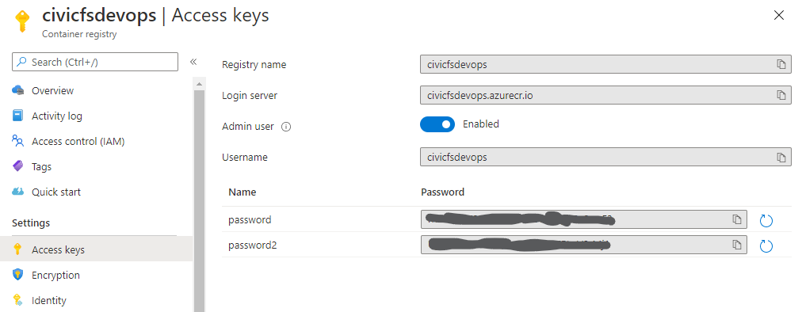

## Logging into the Container Registry
The Azure Container registry requires authentication in order to use it. Logging in can be done by retrieving the `Access Keys` from the resource, assuming the dev has permissions to read it, otherwise see your administrator for this information.



Once the keys have been obtained, docker can authenticate with the registry with the following command:

```
docker login civicfsdevops.azurecr.io
```

Once authenticated, docker will sottre these crednetials until they are invalid or replaced.